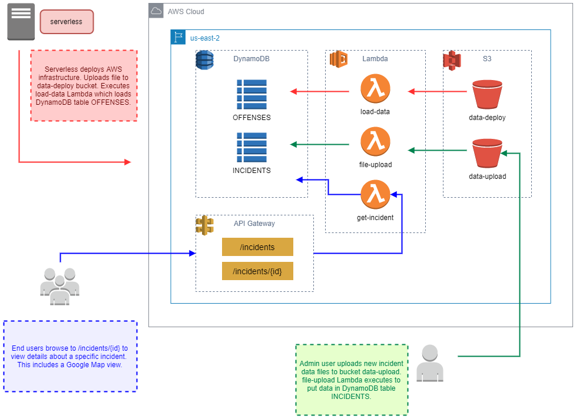
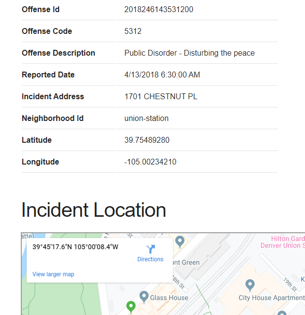

# vf-crime-stats
Demo of serverless framework using crime statistics from Denver, CO

# Use Case
The purpose of this project is to demonstrate the use of the [serverless framework](https://serverless.com/) to build an AWS deployment that
creates Lambda functions, S3 buckets, and Dynamo DB tables. As well as a serverless plugin that invokes a Lambda after the deployment, extracts data from a file in S3 and inserts that data into DynamoDB. In addition, there is an API Gateway endpoint to retrieve an HTML representation of the data and an S3 bucket that will accept new data and upload it to a DynamoDB table.

In this particular project, we'll use crime reporting data from the city of Denver, CO. More information about the data used in this project can be found here: [data/readme.md](data/readme.md).

# Design

*Diagram omits IAM and CloudFormation, along with any other assets created automatically by serverless.*

The serverless framework will create the following AWS service infrastructure:

- Three Lambda functions (load-data, file-upload and  get-incident)
- Two DynamoDB tables (INCIDENTS and OFFENSES)
- Two S3 buckets (data-deploy and data-upload)
- API Gateway endpoint(s) (/incidents and /incidents/{id})
- IAM and CloudFormation assets automatically created by serverless

*Note - The actual names of the deployed infrastructure can change depending on how serverless is configured. Names may be prefixed or suffixed with values in serverless.*

# Functionality
Upon a `serverless deploy` the following will happen:
- serverless will deploy all the defined assets to AWS. This particular deployment is set to deploy to us-east-2 region.
- After deployment, serverless will use the external plugin `serverless-s3-deploy` to copy all the .csv files in the `data/sync` folder to S3 bucket `data-deploy`. For this project that is only `offense_codes.csv`.
- Next, serverless will execute the custom plugin `execute-lambda-plugin` (written for this project). This plugin executes the `load-data` Lambda function which reads the `offense_codes.csv` from the S3 bucket and loads the DynamoDB table OFFENSES.

After the project has been deployed, incident data files need to be manually uploaded to the S3 bucket `data-upload`. This can be done in the AWS console or with the AWS CLI (`aws s3 cp ./data/incidents_1.csv s3://data-upload/incidents_1.csv`). When a new data file is uploaded to that bucket, the Lambda `file-upload` will automatically execute and load the DynamoDB table INCIDENTS. In this project the data files can be found in the `data` folder (incidents_1.csv, incidents_2.csv and incidents_3.csv).

After incident files are uploaded, a user may browse to `http://{base_url}/incidents` or `http://{base_url}/incidents/{id}`. This will display an HTML page with details of the specific incident including a Google Map (based upon the latitude and longitude of the specific incident).

Browser screenshot:

# Dependencies
This project has two external dependencies - **serverless-s3-deploy** and **csvtojson**. Both are referenced in the project's package.json.

`
npm install serverless-s3-deploy
`

`
npm install csvtojson
`

The **serverless-s3-deploy** dependency is a serverless plugin that only needs to run locally (not uploaded to AWS as part of the assets). This plugin is what automatically copies data files to S3 after deployment. More information
[here](https://github.com/funkybob/serverless-s3-deploy).

The **csvtojson** dependency is used by the Lambda functions to ease the reading of .csv files. More information
[here](https://github.com/Keyang/node-csvtojson).

# Future Improvements
This was a first attempt at a serverless project and there are likely some areas of improvement:

- In `serverless.yml`, multiple methods of referencing variables/values are used. Should explore standardizing, investigate best practices. Possibly use seprate .yml files for different pieces of the overall project.
- In `serverless.yml`, IAM permissions and environment variables are defined globally for the project. Ideally these would be applied to individual functions as required.
- Some of the IAM permissions could be more fine-grained. *Note - spent alot of time messing with permissions and arrived at what worked.*
- DynamoDB table structure is relatively simple (based upon the simplicity of data file structure(s)). Possible improvements with hash/sort keys and indexes.
- The html template content in `src/lib/htmlHelper.js` could likely move elsewhere, like S3, so that templates could be updated independently of the Lambda code.
- In `src/getIncident.js`, there might be more efficient ways of replacing content in html template strings - something better than string.replace(a,b)?
- Need to implement a "get all" at the /incidents root endpoint. Right now, calling /incidents displays a generic page. Calling /incidents/{id} requires the end user to know the actual id.
